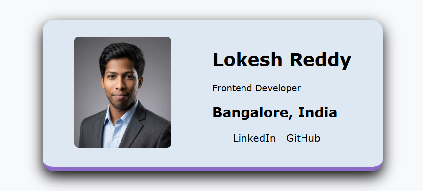
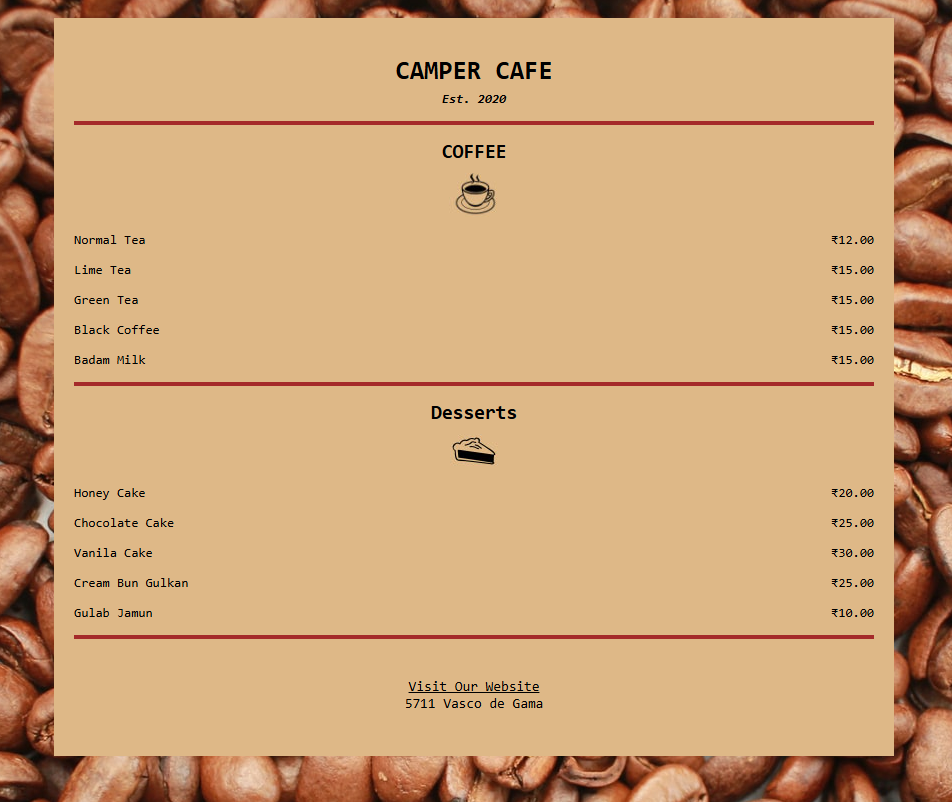
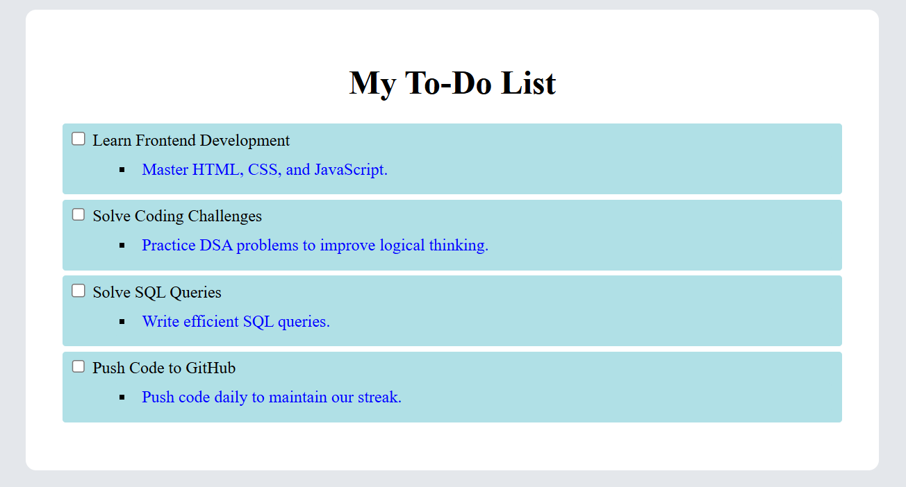
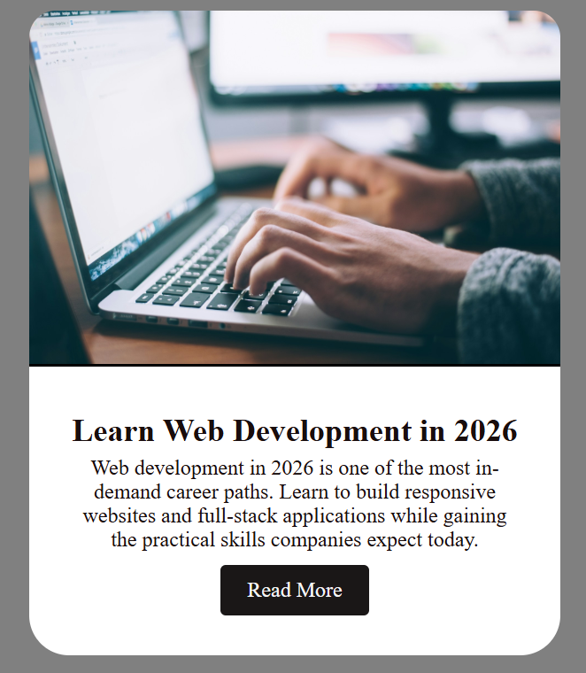
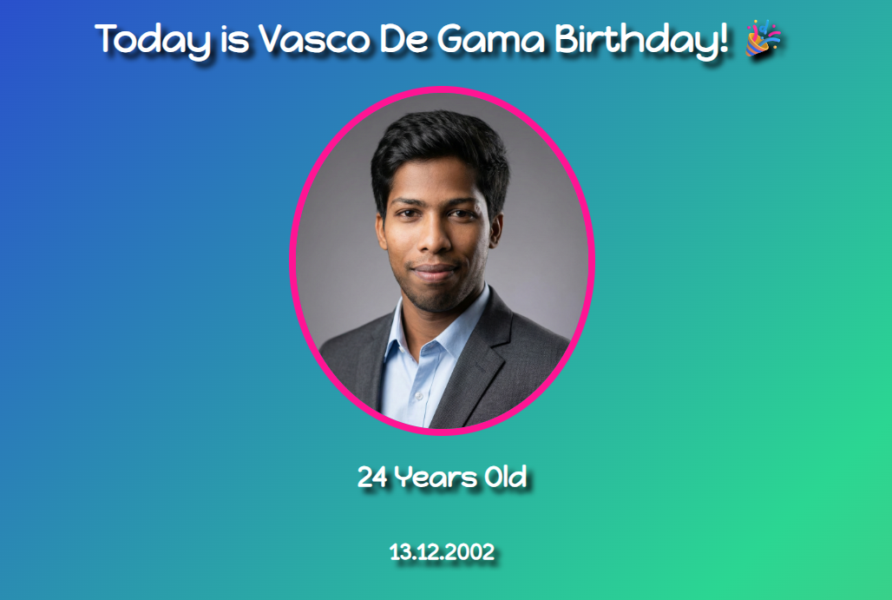

# 🌟 Frontend Playground  

Welcome to my **Frontend Mini Project Collection** — a curated set of UI experiments built to strengthen layout precision, visual hierarchy, and clean styling practices.

Each project is deployed using **GitHub Pages** and focuses on mastering core frontend fundamentals through practical implementation.

---

## 🚀 Live Project Hub  

[](https://lokesh-reddy-kambham.github.io/Frontend-Playground/)

---

## 📸 Project Previews  

### 🪪 Business Card  


A responsive profile card built using Flexbox, focused on alignment, spacing, and clean professional presentation.  

[](https://lokesh-reddy-kambham.github.io/Frontend-Playground/Business-Card/)

---

### ☕ Café Menu  


A warm-toned café UI inspired by real-world menu layouts, emphasizing typography hierarchy and visual balance.  

[](https://lokesh-reddy-kambham.github.io/Frontend-Playground/Cafe-Menu/)

---

### ✅ To-Do List App  


A structured and styled task manager layout focused on content grouping and readability.  

[](https://lokesh-reddy-kambham.github.io/Frontend-Playground/ToDo-List/)

---

### 📰 Blog / Article Card  


A modern blog preview layout featuring image hierarchy, text balance, and call-to-action design.

[](https://lokesh-reddy-kambham.github.io/Frontend-Playground/Blog-post/)

---

### 🎉 Birthday Surprise Page  


A themed celebration page with gradient styling and interactive surprise reveal concept.

[](https://lokesh-reddy-kambham.github.io/Frontend-Playground/Birthday-Surprise/)

---

## 📂 Project Structure  

```
Frontend-Playground/
│
├── Business-Card/
├── Cafe-Menu/
├── Blog-post/
├── Birthday-Surprise/
├── ToDo-List/
│
├── assets/
├── index.html
├── styles.css
└── README.md
```

---

## 🧠 Learning Objectives  

- Semantic HTML structuring  
- Layout control using Flexbox  
- Typography hierarchy  
- Card-based UI systems  
- Spacing consistency  
- Git workflow and deployment via GitHub Pages  

---

## 📈 Skills Demonstrated  

- Component-based thinking using pure HTML/CSS  
- Multi-project hosting strategy  
- Clean file organization  
- Visual balance & UI consistency  
- Deployment & version control workflow  

---

## 🧩 Technologies Used  
| HTML5 | CSS3 | Git | GitHub Pages |
|:------:|:------:|:------:|:------:|
| ✅ | ✅ | ✅ | ✅ |

---

## 🗺️ Roadmap  

- [x] Static UI layout projects  
- [x] Multi-project hosting structure  
- [ ] Add JavaScript interactivity  
- [ ] Improve responsiveness across devices  
- [ ] Add animations & micro-interactions  
- [ ] Convert selected projects into React components  

---

## 🎯 Purpose of This Repository  

This repository represents my journey toward becoming a professional frontend developer.  
Each mini project focuses on improving UI precision, layout discipline, and frontend engineering fundamentals.

> Build consistently. Improve intentionally. Scale progressively.

---

## 🤝 Connect with Me  

[](https://github.com/Lokesh-Reddy-Kambham/)
[](https://www.linkedin.com/in/lokesh-reddy-kambham/)
[](https://www.hackerrank.com/profile/Lokesh_Reddy_)
[](https://leetcode.com/u/Lokesh-Reddy-Kambham/)
[](https://www.sololearn.com/en/profile/30363693)
---
> “The best way to learn frontend development is by building — one mini project at a time.”  
> — *Lokesh Reddy Kambham*